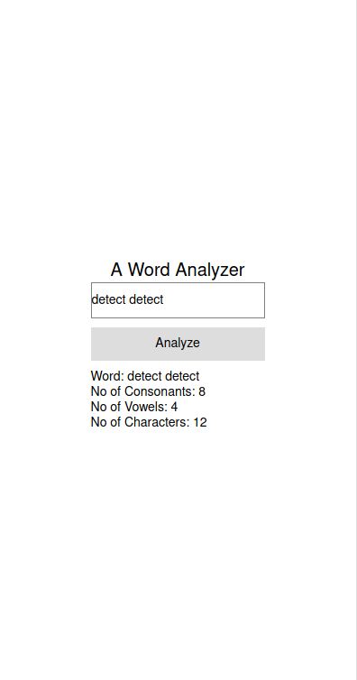

# Word Analyzer (Assignment)

## What does it do?

**WordAnalyzer** is a react word analyzer mobile application. It analyses number of consonants, vowels and total number of characters from input. _Note: This repo is for assignment purpose only, it will only be available within 4 months period_

## How it works?

* User input _(it can be a word or more)_
* Application will parse words by characters as array of characters _(using Split() function)_
* Iterate through each character and verify whether it is a vowel or consonent.
```js
for (let test of res){

	//specify whether its consonants or vowels
	if (test.match(vowels)){
	total_vowels++;
	}
	else if (test.match(conso)){
	total_conso++;
	}

	//get total chars
	if (test != ' '){total_char += test.length;}

}
```
* Application will return total numbers of **vowels, consonents and characters overall**

## Additional Feature

* I added a line of code to ignore spaces if users input sentences with spaces.
```js
if (test != ' '){
	//count characters
}
```
* Created `Count.js` file as a seperate component in `/components` folder. _(Imported in App.js)_

## User Interface


